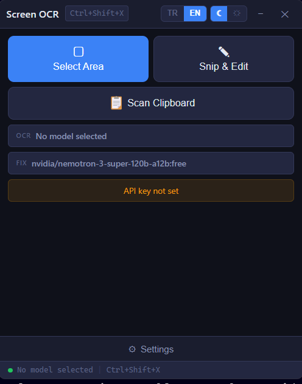

# Screen OCR

AI-powered screen text extraction and image annotation tool for Windows.



## Features

- **Select Area** — Capture any screen region and extract text using AI vision models
- **Snip & Edit** — Annotate screenshots with freehand drawing, arrows, lines, rectangles, text, and eraser
- **Clipboard Scan** — Extract text directly from images in your clipboard
- **AI Text Correction** — Automatically fix OCR character errors using a secondary AI model
- **Multi-language UI** — Switch between Turkish and English with one click
- **Light / Dark Theme** — Toggle between themes instantly
- **Global Hotkey** — Press `Ctrl+Shift+X` anywhere to start a capture
- **System Tray** — Runs quietly in the background, always accessible
- **Auto-launch** — Optionally start with Windows (enabled by default)

## Download

Download the latest installer from the [Releases](https://github.com/palamut62/screen-ocr-app/releases) page.

## Getting Started

1. Install and launch Screen OCR
2. Open **Settings** and enter your [OpenRouter](https://openrouter.ai/) API key
3. Click **Fetch Models** and select an OCR vision model (free models available)
4. Optionally enable AI text correction and select a correction model
5. Click **Select Area** or press `Ctrl+Shift+X` to capture and extract text

## Editor Tools

| Tool | Description |
|------|-------------|
| Draw | Freehand pen drawing |
| Arrow | Double-ended arrow |
| Line | Straight line |
| Rectangle | Rectangle outline |
| Text | Multi-line text with bold, italic, and background options |
| Eraser | Erase annotations |

Text supports multiple lines (Enter for new line, Ctrl+Enter to apply). Includes color picker, adjustable line width, and font size controls.

## Tech Stack

- **Electron** — Desktop application framework
- **React + TypeScript** — UI components
- **Vite** — Fast build tooling
- **Sharp** — Image processing and cropping
- **OpenRouter API** — AI vision and text model access

## Development

```bash
# Install dependencies
npm install

# Run in development mode
npm run dev

# Build for production
npm run build

# Create installer
npm run dist
```

## Build Requirements

- Node.js 18+
- Windows 10/11 (x64)

## License

MIT
