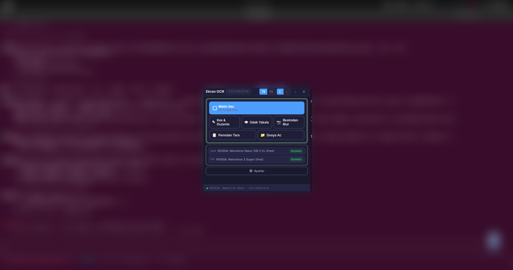

# Screen OCR

> AI-powered screen text extraction and advanced image editing tool — Linux & Windows



---

## Features

### 📝 OCR & Text Extraction
- **Select Area** — Capture any screen region and extract text using AI (`Ctrl+Shift+X`)
- **Clipboard Scan** — Extract text directly from images in your clipboard
- **AI Text Correction** — Automatically fix OCR character errors using a secondary AI model
- **Model Selection** — Dozens of free and paid vision models via OpenRouter

### 🎨 Image Editor (Paint Ribbon UI)
- **Paint-style Ribbon** — MS Paint-like grouped toolbar below the titlebar
- **Open File** — Load PNG, JPG, WebP, BMP, GIF, TIFF files into the editor
- **Open from Web** — Load any image by URL
- **Freehand Drawing** — Smooth pen strokes with Catmull-Rom spline interpolation
- **Highlighter** — Semi-transparent colored marker
- **Fade Pen** — Strokes that automatically fade out in 3 seconds
- **Laser Pointer** — Glowing red laser pointer trail
- **Shapes** — Rectangle, oval, arrow, line
- **Text** — Multi-line text with bold, italic, and background options
- **Eraser** — Remove annotations precisely
- **Color Palette** — 8 preset colors + Rainbow mode
- **Save As** — Export as PNG (lossless), JPG or WebP (with quality slider)
- **Undo / Redo** — Full history management (Ctrl+Z / Ctrl+Y)
- **Always on Top** — Editor window always opens above other windows after a snip

### 🌫️ Blur (Focus Capture)
- **Screen Blur** — Keep selected regions sharp, blur everything else
- **Blur from File** — Open any local image file and apply selective blur
- **Multi-region** — Define multiple sharp focus areas at once
- **Privacy Protection** — Quickly redact sensitive content

### ⚙️ General
- **Multi-language UI** — Turkish and English
- **Light / Dark Theme** — Toggle instantly
- **Global Hotkey** — `Ctrl+Shift+X` from anywhere
- **System Tray** — Runs quietly in the background
- **Auto-launch** — Start automatically on system boot

---

## Download

Download the latest release from the [Releases](https://github.com/palamut62/screen-ocr-app/releases) page.

| Platform | File |
|----------|------|
| Linux (Debian/Ubuntu) | `screen-ocr-app_x.x.x_amd64.deb` |
| Linux (Other) | `Screen OCR-x.x.x.AppImage` |
| Windows | `Screen OCR Setup x.x.x.exe` |

---

## Installation

### Linux — .deb (Debian/Ubuntu)
```bash
sudo dpkg -i screen-ocr-app_1.5.0_amd64.deb
```

### Linux — AppImage
```bash
chmod +x "Screen OCR-1.5.0.AppImage"
./"Screen OCR-1.5.0.AppImage"
```

### Getting Started
1. Launch Screen OCR
2. Open **Settings** and enter your [OpenRouter](https://openrouter.ai/) API key
3. Click **Fetch Models** and select an OCR vision model (free models available)
4. Optionally enable AI text correction and pick a correction model
5. Click **Select Text** or press `Ctrl+Shift+X` to capture and extract text

---

## Editor Shortcuts

| Tool | Key | Description |
|------|-----|-------------|
| Select | `1` | Select and move figures |
| Pen | `2` | Freehand drawing |
| Highlighter | `3` | Semi-transparent marker |
| Fade Pen | `4` | Auto-fading strokes |
| Laser | `5` | Laser pointer trail |
| Arrow | `6` | Arrow shape |
| Line | `7` | Straight line |
| Rectangle | `8` | Rectangle outline |
| Oval | `9` | Ellipse outline |
| Text | `0` | Add text |
| Undo | `Ctrl+Z` | Undo last action |
| Redo | `Ctrl+Y` | Redo undone action |
| Duplicate | `Ctrl+D` | Duplicate selected figure |
| Delete | `Delete` | Remove selected figure |
| Nudge | `←↑→↓` | Move 1px (Shift: 10px) |

---

## Tech Stack

- **Electron** — Desktop application framework
- **React + TypeScript** — UI components
- **Vite** — Fast build tooling
- **Sharp** — Image processing (blur, crop, format conversion)
- **OpenRouter API** — AI vision and text model access

---

## Development

```bash
# Install dependencies
npm install

# Run in development mode
npm run dev

# Production build
npm run build

# Build Linux installer
npm run dist:linux

# Build Windows installer
npm run dist
```

### Requirements
- Node.js 18+
- Linux x64 or Windows 10/11 x64

---

## Changelog

| Version | Highlights |
|---------|-----------|
| **v1.5.0** | Blur from file feature |
| **v1.4.0** | Paint ribbon editor, open from web, multi-format save |
| **v1.3.1** | Multi-region blur, screenshots |
| **v1.3.0** | DrawPen editing features |

---

## License

MIT
