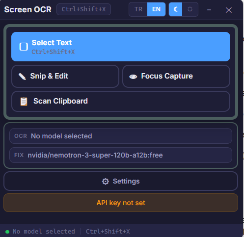
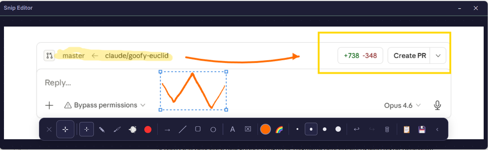

# Screen OCR

> AI destekli ekran metni çıkarma ve gelişmiş resim düzenleme aracı — Linux & Windows


---

## Özellikler

### 📝 OCR & Metin Çıkarma
- **Alan Seç** — Ekranın herhangi bir bölgesini seçerek AI ile metin çıkar (`Ctrl+Shift+X`)
- **Panodan Tara** — Panodaki resimden doğrudan metin çıkar
- **AI Metin Düzeltme** — OCR hatalarını ikincil bir AI modeliyle otomatik düzelt
- **Model Seçimi** — OpenRouter üzerinden ücretsiz ve ücretli onlarca vision modeli

### 🎨 Resim Editörü (Paint Ribbon Arayüz)
- **Paint Tarzı Ribbon** — Titlebar altında MS Paint benzeri gruplu araç çubuğu
- **Dosya Aç** — PNG, JPG, WebP, BMP, GIF, TIFF formatlarını editörde aç
- **Web'den Resim** — URL girerek internetten resim yükle
- **Serbest Çizim** — Catmull-Rom spline ile düzgünleştirilmiş kalem darbeleri
- **İşaretleyici** — Şeffaf renkli marker
- **Solma Kalemi** — 3 saniyede otomatik solan çizgiler
- **Lazer İşaretçi** — Kırmızı parlayan laser pointer izi
- **Şekiller** — Dikdörtgen, oval, ok, çizgi
- **Metin** — Çok satırlı metin; kalın, italik, arka plan seçeneği
- **Silgi** — Annotation'ları temizle
- **Renk Paleti** — 8 hazır renk + Gökkuşağı modu
- **Farklı Kaydet** — PNG (kayıpsız), JPG veya WebP (kalite slider ile)
- **Geri Al / İleri Al** — Tam geçmiş yönetimi (Ctrl+Z / Ctrl+Y)
- **Editör en önde** — Ekran alıntısı sonrası editör her zaman en üstte açılır

### 🌫️ Blur (Odak Yakalama)
- **Ekran Blurlama** — Seçilen bölgeler keskin kalır, geri kalan alan bulanıklaşır
- **Resimden Blur** — Bilgisayarınızdaki herhangi bir resim dosyasını açıp blur uygulayın
- **Çoklu Bölge** — Birden fazla keskin bölge tanımla
- **Gizlilik Koruması** — Hassas içerikleri hızlıca gizle

### ⚙️ Genel
- **Çoklu Dil** — Türkçe ve İngilizce arayüz
- **Açık / Koyu Tema** — Tek tıkla tema değiştir
- **Global Kısayol** — `Ctrl+Shift+X` ile anında yakalama
- **Sistem Tepsisi** — Arka planda sessizce çalışır
- **Otomatik Başlatma** — Sistem açılışında otomatik başlat

---

## Ekran Görüntüleri

| Ana Ekran | Editör |
|-----------|--------|
|  |  |

---

## İndirme

En son sürümü [Releases](https://github.com/palamut62/screen-ocr-app/releases) sayfasından indirin.

| Platform | Dosya |
|----------|-------|
| Linux (Debian/Ubuntu) | `screen-ocr-app_x.x.x_amd64.deb` |
| Linux (Diğer) | `Screen OCR-x.x.x.AppImage` |
| Windows | `Screen OCR Setup x.x.x.exe` |

---

## Kurulum

### Linux — .deb (Debian/Ubuntu)
```bash
sudo dpkg -i screen-ocr-app_1.5.0_amd64.deb
```

### Linux — AppImage
```bash
chmod +x "Screen OCR-1.5.0.AppImage"
./"Screen OCR-1.5.0.AppImage"
```

### Başlarken
1. Uygulamayı başlat
2. **Ayarlar**'ı aç ve [OpenRouter](https://openrouter.ai/) API anahtarını gir
3. **Modelleri Getir**'e tıkla ve bir OCR vision modeli seç (ücretsiz modeller mevcut)
4. İsteğe bağlı olarak AI metin düzeltmeyi etkinleştir
5. **Metin Seç**'e tıkla veya `Ctrl+Shift+X` kısayolunu kullan

---

## Editör Araçları

| Araç | Kısayol | Açıklama |
|------|---------|----------|
| Seç | `1` | Figure seç, taşı |
| Kalem | `2` | Serbest çizim |
| İşaretleyici | `3` | Şeffaf marker |
| Solma Kalemi | `4` | Otomatik solan çizgi |
| Lazer | `5` | Lazer işaretçi izi |
| Ok | `6` | Ok şekli |
| Çizgi | `7` | Düz çizgi |
| Dikdörtgen | `8` | Dikdörtgen |
| Oval | `9` | Elips |
| Metin | `0` | Metin ekle |
| Silgi | — | Annotation sil |
| Geri Al | `Ctrl+Z` | Son işlemi geri al |
| İleri Al | `Ctrl+Y` | Geri alınanı yinele |
| Çoğalt | `Ctrl+D` | Seçili figürü kopyala |
| Sil | `Delete` | Seçili figürü sil |
| Kaydır | `←↑→↓` | Seçiliyi 1px taşı (Shift: 10px) |

---

## Teknoloji Yığını

- **Electron** — Masaüstü uygulama çatısı
- **React + TypeScript** — UI bileşenleri
- **Vite** — Hızlı build aracı
- **Sharp** — Görüntü işleme (blur, kırpma, format dönüşümü)
- **OpenRouter API** — AI vision ve metin modeli erişimi

---

## Geliştirme

```bash
# Bağımlılıkları yükle
npm install

# Geliştirme modunda çalıştır
npm run dev

# Üretim build
npm run build

# Linux installer oluştur
npm run dist:linux

# Windows installer oluştur
npm run dist
```

### Gereksinimler
- Node.js 18+
- Linux x64 veya Windows 10/11 x64

---

## Sürüm Geçmişi

| Sürüm | Öne Çıkan |
|-------|-----------|
| **v1.5.0** | Resimden blur özelliği |
| **v1.4.0** | Paint ribbon editör, web'den resim, çok formatlı kayıt |
| **v1.3.1** | Multi-region blur, ekran görüntüleri |
| **v1.3.0** | DrawPen düzenleme özellikleri |

---

## Lisans

MIT
